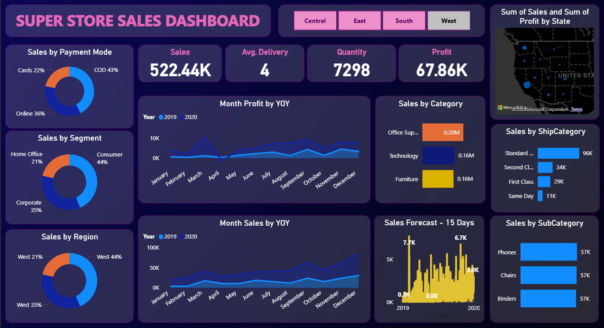
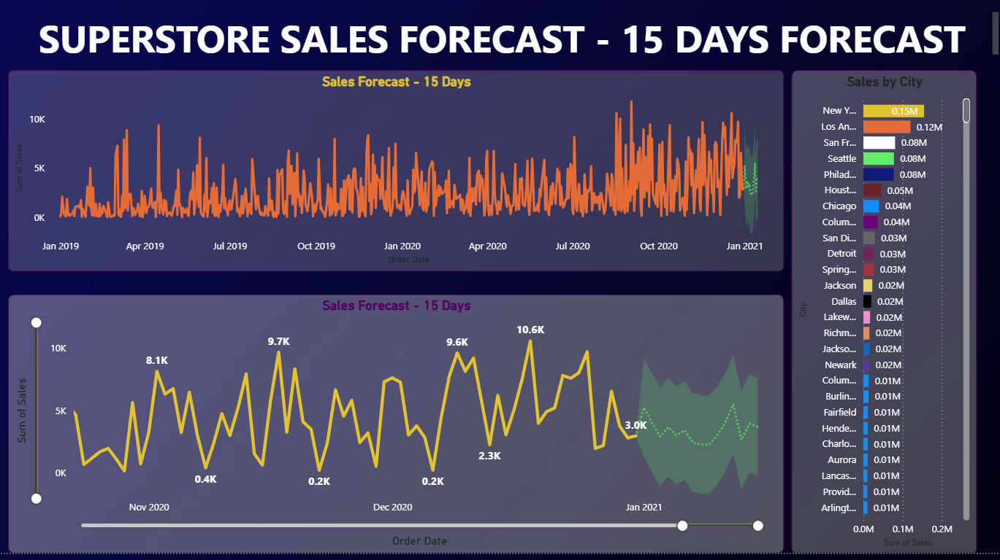

# 📊 Power BI Sales Dashboard Project

Welcome to the **Power BI Sales Dashboard Project**, an advanced business intelligence dashboard built using **Power BI Desktop**, **DAX**, and **Sales Forecasting techniques**. It empowers organizations to analyze sales data, visualize KPIs, and forecast future trends interactively.

---

## 🔍 Project Overview

This project was created to:

- Analyze historical sales data  
- Use **DAX queries** for KPIs, calculations, and forecasting  
- Create a professional, interactive **Power BI dashboard**  
- Provide exportable reports for business presentations  

> 📌 Tools Used: Power BI Desktop, DAX, Excel, Forecast Visuals

---

## 🖼️ Dashboard Screenshots

### 📈 Main Sales Dashboard



### 🔮 Forecasting Panel




> 📌 These images are directly linked from the repository root.

---

## ✨ Features

- ✅ Real-time KPIs (Revenue, Profit, Quantity)
- ✅ Interactive Filters (Region, Year, Category)
- ✅ Custom DAX Measures & Calculated Tables
- ✅ Sales Forecasting (Rolling Average + Native Forecast)
- ✅ Drill-down Charts & Tooltip-based Interactions
- ✅ Export to PDF & PPT for reports
- ✅ Mobile/Responsive View Compatible
- ✅ Clean & Modern UI

---

## 🧠 DAX Measures

```dax
-- Total Sales
Total Sales = SUM(Sales[Sales Amount])

-- Profit Margin
Profit Margin % = DIVIDE(SUM(Sales[Profit]), SUM(Sales[Sales Amount]))

-- Forecast with Rolling 3-Month Average
Rolling Forecast = 
    AVERAGEX(
        DATESINPERIOD('Date'[Date], LASTDATE('Date'[Date]), -3, MONTH),
        [Total Sales]
    )

-- Year-over-Year Growth
YoY Growth = 
    DIVIDE(
        [Total Sales] - CALCULATE([Total Sales], SAMEPERIODLASTYEAR('Date'[Date])),
        CALCULATE([Total Sales], SAMEPERIODLASTYEAR('Date'[Date]))
    )
